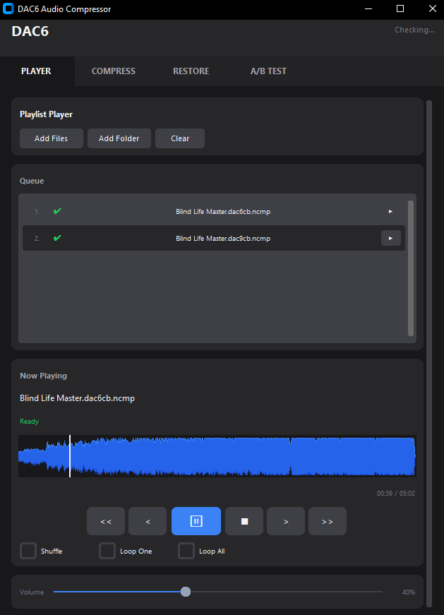

# DAC6 Audio Compressor

**Neural audio compression GUI using Descript Audio Codec (DAC). GPU-accelerated batch processing for music and speech compression with transparent quality at ultra-low bitrates (32-128 kbps). Python-based tool with A/B quality testing and built-in player.**

---

## 🎯 Features

- **🗜️ COMPRESS** - Batch neural audio compression (9-21 kbps for music, ultra-low bitrates)
- **📂 RESTORE** - Decompress `.ncmp` files to WAV/FLAC/MP3
- **🔍 A/B TEST** - Side-by-side quality comparison with synchronized playback
- **🎵 PLAYER** - Built-in music player with playlist support, shuffle, and loop modes
- **⚡ GPU Acceleration** - Fast processing with NVIDIA CUDA support
- **📦 Batch Processing** - Drag & drop multiple files, process entire folders
- **🎚️ Configurable Quality** - Choose codebooks (6-16) for size vs quality balance
- **🔊 HQ Resampling** - Automatic 44.1kHz resampling with high-quality filters

---

## 📸 Screenshot

### DAC6 Player Interface



**Features shown:**
- **4 Tabs**: PLAYER, COMPRESS, RESTORE, A/B TEST
- **Playlist Queue** with pre-decoded tracks (✓ checkmarks indicate ready-to-play)
- **Waveform Visualization** with seek capability
- **Playback Controls**: Previous, Play/Pause, Next, Skip (<<, <, ▶/⏸, >, >>)
- **Loop Modes**: Shuffle, Loop One, Loop All
- **Volume Control** with real-time adjustment
- **Now Playing** display with track name and status

---

## 🎧 Audio Examples

**Listen to compression quality with 30-second samples** (from "Blind Life Master" by ignaciosua_h, starting at 1:00 where the music is fully developed):

### 🎵 Original (192 kbps MP3) - 711 KB
<audio controls>
  <source src="examples/original-30s.mp3" type="audio/mpeg">
  Your browser does not support audio playback. <a href="examples/original-30s.mp3">Download MP3</a>
</audio>

**Reference source** - Standard MP3 compression at 192 kbps

---

### 🗜️ DAC 6 kbps (6 codebooks) - 46 KB compressed → **32x compression ratio**
<audio controls>
  <source src="examples/restored-6kbps-30s.mp3" type="audio/mpeg">
  Your browser does not support audio playback. <a href="examples/restored-6kbps-30s.mp3">Download MP3</a>
</audio>

**Transparent quality** - Ideal for archival/streaming at extreme compression. Hard to distinguish from original in casual listening.

---

### 🗜️ DAC 9 kbps (9 codebooks) - 69 KB compressed → **21x compression ratio**
<audio controls>
  <source src="examples/restored-9kbps-30s.mp3" type="audio/mpeg">
  Your browser does not support audio playback. <a href="examples/restored-9kbps-30s.mp3">Download MP3</a>
</audio>

**Near-perfect reconstruction** - Extremely difficult to distinguish from original, even in blind A/B tests.

---

### 🔍 What to Listen For

- **Compare clarity** - Listen for preservation of vocals, instruments, and stereo imaging
- **Artifacts** - Neural compression avoids typical MP3/AAC artifacts (ringing, pre-echo)
- **Dynamics** - Notice how transients and bass response are maintained even at 6 kbps
- **File size** - Same 30 seconds: 711 KB (original) vs 46 KB (6 kbps) = 15.5x smaller!

**Use headphones for best comparison.** The differences are subtle but noticeable with good audio equipment.

---

## 🚀 Quick Start

### Windows Installation

1. **Download** the repository
2. **Run** `DAC6_Setup.bat` (one-click installer)
3. Wait for dependencies to download (~1.1 GB)
4. The GUI will launch automatically

### Mac/Linux Installation (AI Assistant Setup)

**Prerequisites:**
- **Mac**: Python 3.11+ (install with `brew install python@3.11` if needed)
- **Linux**: Python 3.11+ (usually pre-installed, or `sudo apt install python3.11 python3.11-venv`)
- **Both**: ffmpeg (`brew install ffmpeg` on Mac, `sudo apt install ffmpeg` on Linux)

**AI-Assisted Installation:**

Copy and paste this prompt to **Claude, GitHub Copilot Chat, or ChatGPT** to automatically set up DAC6:

```
Please help me install DAC6 Audio Compressor on my system. Follow these steps:

1. Check if Python 3.11+ is installed (python3 --version). If not, guide me to install it.

2. Check if ffmpeg is installed (ffmpeg -version). If not, install it:
   - Mac: brew install ffmpeg
   - Linux: sudo apt install ffmpeg

3. Clone the repository:
   git clone https://github.com/ignaciosua/dac-player.git
   cd dac-player

4. Create and activate virtual environment:
   python3 -m venv .venv
   source .venv/bin/activate

5. Install PyTorch (CPU version for Mac, CUDA for Linux with NVIDIA GPU):
   - Mac/Linux CPU: pip install torch torchvision torchaudio
   - Linux CUDA: pip install torch torchvision torchaudio --index-url https://download.pytorch.org/whl/cu121

6. Install DAC6 dependencies:
   pip install descript-audio-codec descript-audiotools soundfile sounddevice customtkinter tkinterdnd2 "numpy<2"

7. Test the installation by running:
   python dac6_gui.py

If you encounter any errors, diagnose the issue and provide a fix.
My OS: [specify: macOS/Linux]
My Python version: [run: python3 --version]
```

The AI will execute these commands and help troubleshoot any issues.

### Manual Installation

```bash
# Clone repository
git clone https://github.com/ignaciosua/dac-player.git
cd dac-player

# Create virtual environment
python3 -m venv .venv
source .venv/bin/activate  # Mac/Linux
# .venv\Scripts\activate  # Windows

# Install PyTorch
# For Mac/Linux CPU:
pip install torch torchvision torchaudio

# For Linux with NVIDIA GPU:
pip install torch torchvision torchaudio --index-url https://download.pytorch.org/whl/cu121

# Install DAC6 dependencies
pip install descript-audio-codec descript-audiotools soundfile sounddevice customtkinter tkinterdnd2 "numpy<2"

# Install ffmpeg (if not already installed)
# Mac: brew install ffmpeg
# Linux: sudo apt install ffmpeg

# Run GUI
python dac6_gui.py
```

---

## 💻 Usage

### GUI Mode (Recommended)

1. **Launch** the application via `DAC6_Setup.bat` or `python dac6_gui.py`
2. **Select** the COMPRESS tab
3. **Drag & drop** audio files (MP3, WAV, FLAC, AAC, OGG, M4A, Opus)
4. **Configure** settings:
   - **Codebooks**: 9 (default), 6 (smallest), 16 (highest quality)
   - **Chunk Size**: 60s (default), 120-300s (faster, more VRAM)
5. **Click** "PROCESS ALL"
6. **Test quality** in the A/B TEST tab
7. **Play** compressed files in the PLAYER tab

### Command Line Interface

```bash
# Compress audio file
python dac6.py encode input.mp3 --n-codebooks 9 --chunk-size 60

# Restore compressed file
python dac6.py decode input.dac9cb.ncmp

# Play compressed file
python dac6.py play input.dac9cb.ncmp

# Show file info
python dac6.py info input.dac9cb.ncmp
```

---

## ⚙️ Configuration

### Codebooks (Quality vs Size)

| Codebooks | Bitrate | Use Case |
|-----------|---------|----------|
| 6 | ~9 kbps | Minimum size, voice/podcasts |
| 9 | ~12 kbps | **Default**, excellent quality/size balance |
| 12 | ~16 kbps | High quality music |
| 16 | ~21 kbps | Maximum quality, near-transparent |

### Chunk Size (Speed vs VRAM)

| Chunk Size | VRAM Required | Processing Speed |
|------------|---------------|------------------|
| 30-60s | 4 GB | Standard |
| 120-180s | 6 GB | Fast |
| 250-300s | 8 GB+ | Maximum performance |

### Models

- **44.1 kHz** - Music, high-fidelity audio (default)
- **24 kHz** - Speech, podcasts
- **16 kHz** - Voice, low-bandwidth applications

---

## 🎛️ Advanced Features

### Batch Processing
- **Drag & drop** entire folders
- **Automatic queue** management
- **Progress tracking** per file
- **Error handling** with detailed logs

### Quality Testing
- **Synchronized playback** of original vs compressed
- **Waveform visualization** for both tracks
- **Independent volume** controls
- **Instant A/B switching**

### Music Player
- **Auto-decode** compressed files on demand
- **Playlist** with shuffle and loop modes
- **Waveform** with seek capability
- **Pre-decode** caching for instant playback

### Audio Processing
- **Automatic resampling** to target sample rate
- **500ms overlap** between chunks (eliminates artifacts)
- **Stereo processing** with independent channel encoding
- **HQ filters** (256-tap, 10 phase shifts)

---

## 📋 Requirements

### System Requirements
- **OS**: Windows 10/11, Linux (Ubuntu 20.04+, Debian, Fedora), macOS 11+
- **Python**: 3.11+ (3.11.9 recommended)
- **Disk Space**: 2-3 GB (PyTorch + DAC models + dependencies)
- **RAM**: 4 GB minimum, 8 GB recommended
- **GPU**: NVIDIA GPU with CUDA support (optional, CPU mode works on all platforms)

### Platform-Specific Requirements

**Windows:**
- Automatic installation via `DAC6_Setup.bat`
- Python auto-downloaded if not present
- ffmpeg auto-downloaded during setup

**macOS:**
- Python 3.11+: `brew install python@3.11` (if not installed)
- ffmpeg: `brew install ffmpeg`
- Xcode Command Line Tools: `xcode-select --install`

**Linux:**
- Python 3.11+: Pre-installed on most distros, or `sudo apt install python3.11 python3.11-venv`
- ffmpeg: `sudo apt install ffmpeg` (Debian/Ubuntu) or `sudo yum install ffmpeg` (Fedora/RHEL)
- Build tools: `sudo apt install build-essential python3-dev portaudio19-dev`

### Python Dependencies
- PyTorch 2.0+ (CUDA 12.1 for NVIDIA GPUs, CPU-only for Mac/systems without GPU)
- descript-audio-codec (neural audio codec)
- descript-audiotools (audio processing utilities)
- soundfile (audio I/O)
- sounddevice (real-time audio playback)
- customtkinter (modern GUI framework)
- tkinterdnd2 (drag & drop support)
- numpy <2.0 (compatibility requirement)

**Note:** All Python dependencies are automatically installed during setup. The DAC model (~293 MB) downloads automatically on first use to `~/.cache/descript/dac/`.

---

## 🔧 Troubleshooting

### Installation Issues

**Windows:**
If setup fails, run the diagnostic tool:
```bash
Diagnostic_Check.bat
```

**Mac/Linux:**
If you encounter issues, verify your setup:
```bash
# Check Python version (must be 3.11+)
python3 --version

# Check ffmpeg installation
ffmpeg -version

# Check if virtual environment is activated
which python  # Should show .venv/bin/python

# View installation logs
cat dac6.log
```

For AI-assisted troubleshooting, paste any error messages to Claude/Copilot/ChatGPT along with your OS and Python version.

### Common Problems

**"CUDA out of memory"**
- Reduce chunk size to 30-60s in settings
- Close other GPU applications
- Use CPU mode (slower but works on all systems)

**"Module not found" / Import errors**
- Ensure virtual environment is activated: `source .venv/bin/activate`
- Windows: Re-run `DAC6_Setup.bat`
- Mac/Linux: Reinstall dependencies: `pip install -r requirements.txt` (if available) or run the installation commands again

**"ffmpeg not found"**
- **Windows**: Run `DAC6_Setup.bat` again (auto-downloads ffmpeg)
- **Mac**: `brew install ffmpeg`
- **Linux**: `sudo apt install ffmpeg` or `sudo yum install ffmpeg`

**"portaudio" or "sounddevice" errors (Mac/Linux)**
- **Mac**: `brew install portaudio`
- **Ubuntu/Debian**: `sudo apt install portaudio19-dev python3-dev`
- **Fedora/RHEL**: `sudo yum install portaudio-devel python3-devel`
- Then reinstall: `pip install --force-reinstall sounddevice`

**"tkinter not found" (Linux)**
- **Ubuntu/Debian**: `sudo apt install python3-tk`
- **Fedora/RHEL**: `sudo yum install python3-tkinter`

**Permission errors (Mac/Linux)**
- Don't use `sudo` with pip when in a virtual environment
- If you need to install system packages, use your package manager (brew/apt/yum) with sudo
- Virtual environment packages should install without sudo

### Logs

All operations are logged to `dac6.log` in the application directory.

---

## 🎓 How It Works

DAC6 uses the **Descript Audio Codec (DAC)**, a state-of-the-art neural audio compression model:

1. **Input**: Audio is resampled to 44.1 kHz (or 24/16 kHz)
2. **Encoding**: Neural network compresses audio to latent codes
3. **Quantization**: Codes are quantized using residual vector quantization (RVQ)
4. **Storage**: Compressed codes stored in `.ncmp` format
5. **Decoding**: Neural decoder reconstructs audio from codes

The codec achieves **perceptually transparent** quality at bitrates as low as 12 kbps by learning audio representations end-to-end.

---

## 📊 Benchmarks

### Compression Ratios

| Format | Bitrate | File Size (5 min) | Compression Ratio |
|--------|---------|-------------------|-------------------|
| WAV (uncompressed) | 1411 kbps | 52.9 MB | 1:1 |
| FLAC (lossless) | ~900 kbps | 33.8 MB | 1.6:1 |
| MP3 320 kbps | 320 kbps | 12.0 MB | 4.4:1 |
| MP3 128 kbps | 128 kbps | 4.8 MB | 11:1 |
| **DAC 16 codebooks** | **21 kbps** | **0.8 MB** | **66:1** |
| **DAC 9 codebooks** | **12 kbps** | **0.45 MB** | **118:1** |

### Processing Speed (NVIDIA RTX 3060)

- **Encoding**: ~60x realtime (9 codebooks, 60s chunks)
- **Decoding**: ~100x realtime
- **Batch**: 100 files (5 min each) in ~5 minutes

---

## 🤝 Contributing

Contributions are welcome! Please feel free to submit pull requests or open issues.

### Development Setup

```bash
git clone https://github.com/yourusername/dac6-audio-compressor.git
cd dac6-audio-compressor
python -m venv .venv
source .venv/bin/activate
pip install -r requirements.txt
```

---

## 📄 License

This project is licensed under the MIT License. See [LICENSE](LICENSE) for details.

---

## 🙏 Credits

- **DAC Neural Codec**: [Descript Inc.](https://github.com/descriptinc/descript-audio-codec)
- **PyTorch**: [Meta AI](https://pytorch.org/)
- **CustomTkinter**: [Tom Schimansky](https://github.com/TomSchimansky/CustomTkinter)
- **ffmpeg**: [FFmpeg Team](https://ffmpeg.org/)

---

## 📚 Related Projects

- [Descript Audio Codec](https://github.com/descriptinc/descript-audio-codec) - Official DAC implementation
- [EnCodec](https://github.com/facebookresearch/encodec) - Meta's neural audio codec
- [SoundStream](https://github.com/wesbz/SoundStream) - Google's neural audio codec

---

## 🔗 Links

- **Documentation**: [Wiki](https://github.com/yourusername/dac6-audio-compressor/wiki)
- **Issues**: [Bug Reports](https://github.com/yourusername/dac6-audio-compressor/issues)
- **Discussions**: [Community](https://github.com/yourusername/dac6-audio-compressor/discussions)

---

## ⭐ Star History

If you find this project useful, please consider giving it a star!

---

**Keywords**: neural audio compression, DAC codec, GPU audio processing, batch audio compressor, transparent compression, ultra-low bitrate, Python audio tools, music compression, speech compression, AI audio codec, perceptual audio coding
